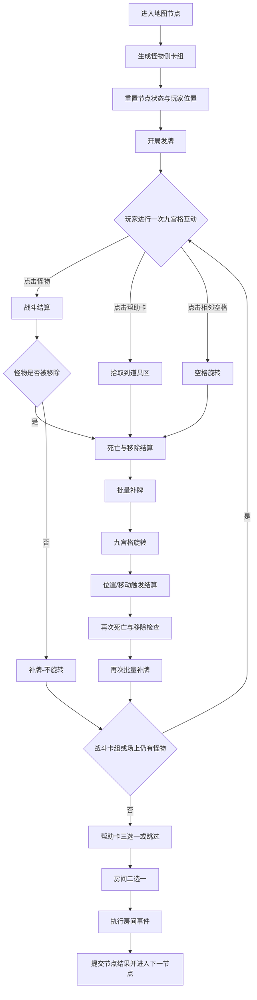

---
tags:
  - 关卡
  - 机制
  - 设计
aliases:
  - 地图节点
  - 关卡
  - 精英
  - 层主
  - 房间卡
created: 2026-06-09
---
            
# 层级系统

## 整体结构

游戏共 **3层**，每层 **9个地图节点**（即9关），共27关。击杀最后一层（第3层）的 [[层主]] 后，游戏通关。

## 地图节点

每个 [[地图节点]] 对应一个 [[关卡]]。节点内是一次完整的战斗流程。

## 关卡循环流程

节点流程固定为以下阶段，前一阶段未完成不得进入下一阶段：

1. **buildMonsterDeck**：生成怪物侧卡组
2. **resetNodeState**：确认 [[玩家卡]] 位置在格5，重置节点状态
3. **openingDeal**：按 [[游戏开发项目/九宫牌局/01-机制规则/发牌机制]] 开局发牌
4. **actionLoop**：玩家互动循环（战斗/拾取/旋转），每次互动后触发空格补牌。详见 [[游戏开发项目/九宫牌局/01-机制规则/卡牌移动]]
5. **clearCheck**：战斗卡组与九宫格上无任何 [[怪物卡]] 时，视为通关。详见 [[游戏开发项目/九宫牌局/01-机制规则/战斗机制#通关判定]]
6. **helpCardChoice**：通关后帮助卡三选一（可跳过直接 +10 [[游戏开发项目/九宫牌局/00-核心概念/金币]]）
7. **roomChoice**：出现两个 [[房间卡]] 按钮，玩家可自行选择时机点击其一
8. **roomResolve**：执行所选房间事件，完成后提交节点结果
9. **nextNode**：前往下一节点

> 每个关卡结束后怪物侧卡组不继承到下一关卡，帮助卡使用后默认永久移除。详见 [[游戏开发项目/九宫牌局/02-卡牌/卡组管理]]。

## 怪物侧卡组构成

每层开始时，从[[弱精英牌组]]（流浪军团/石人军团）、[[强精英牌组]]（兽人军团/骷髅军团）、[[层主牌组]]（巨龙/虚空）中各随机选择一套作为本层使用的牌组。每层独立随机，互不影响。
每个节点的怪物侧卡组从被选中的牌组中按下方表格规则随机抽取生成。怪物总数为每地图节点固定值

**生成规则**：从存在配额的**最低等级**开始逐级随机取值，最高等级数量 = 总数 - 已生成数量（自动填充）。精英/层主怪物**额外加入**，不计入总数。

| 节点  | 总数  | 等级1 | 等级2     | 等级3     | 精英  | 层主  | 牌组        |
| :-- | :-- | :-- | :------ | :------ | :-- | --- | :-------- |
| 1   | 10  | 7~8 |  (自动)   | —       | —   | —   | [[弱精英牌组]] |
| 2   | 11  | 5~6 | 3~4     | 1~2(自动) | —   | —   | [[弱精英牌组]] |
| 3   | 12  | 3~4 | 5~6     | 2~4(自动) | 1   | —   | [[弱精英牌组]] |
| 4   | 12  | 8~9 | 3~4(自动) | —       | —   | —   | [[强精英牌组]] |
| 5   | 13  | 6~7 | 4~5     | 1~3(自动) | —   | —   | [[强精英牌组]] |
| 6   | 14  | 4~5 | 5~6     | 3~5(自动) | 1   | —   | [[强精英牌组]] |
| 7   | 14  | 8~9 | 5~6(自动) | —       | —   | —   | [[层主牌组]]  |
| 8   | 15  | 6~7 | 6~7     | 1~3(自动) | —   | —   | [[层主牌组]]  |
| 9   | 16  | 4~5 | 7~8     | 3~5(自动) | —   | 1   | [[层主牌组]]  |

**精英/层主击杀奖励**（在 `killMonster` 阶段触发，`removeCard` 后洗入战斗卡组）：
- [[精英]] 死亡后洗入战斗卡组：1张 [[游戏开发项目/九宫牌局/07-数据/帮助卡数据|蓝色宝箱卡]]、1张 [[游戏开发项目/九宫牌局/07-数据/帮助卡数据|金币卡]]、1张 [[游戏开发项目/九宫牌局/07-数据/帮助卡数据|属性提升卡]]
- [[层主]] 死亡后洗入战斗卡组：1张 [[游戏开发项目/九宫牌局/07-数据/帮助卡数据|金色宝箱卡]]、2张 [[游戏开发项目/九宫牌局/07-数据/帮助卡数据|金币卡]]、1张 [[游戏开发项目/九宫牌局/07-数据/帮助卡数据|属性提升卡]]

## 房间类型

通关后从房间卡中选择。选择和触发特定事件

| 房间类型    | 说明                                                                                      |
| :------ | :-------------------------------------------------------------------------------------- |
| **商店**  | 展示6张 [[帮助卡]] 供购买，加入玩家侧卡组。还可以从牌组中删除帮助卡，每删除一张获得10 [[游戏开发项目/九宫牌局/00-核心概念/金币]]              |
| **金币房** | 获得50金币                                                                                  |
| **宝箱房** | 从三件遗物中选择一件（白色遗物 65%，蓝色遗物 30%，金色遗物 5%）                                                   |
| **温泉房** | 提高玩家4点血量上限，并恢复满玩家血量                                                                     |
| **酒馆**  | 出现四个选项每个均可使用一次：狂饮（恢复10点血量，扣除20金币），打铁（基础护甲+1，扣除30金币），购物（随机获得一张帮助卡，扣除50金币），离开（离开酒馆进入下一节点） |
|         |                                                                                         |
|         |                                                                                         |
|         |                                                                                         |

## 关卡流程示意图

## 相关
- [[游戏开发项目/九宫牌局/07-数据/怪物卡数据]] — 具体怪物属性与技能
- [[游戏开发项目/九宫牌局/01-机制规则/发牌机制]] — 关卡开始时的发牌流程
- [[游戏开发项目/九宫牌局/02-卡牌/卡组管理]] — 怪物侧卡组的运行时生成规则
